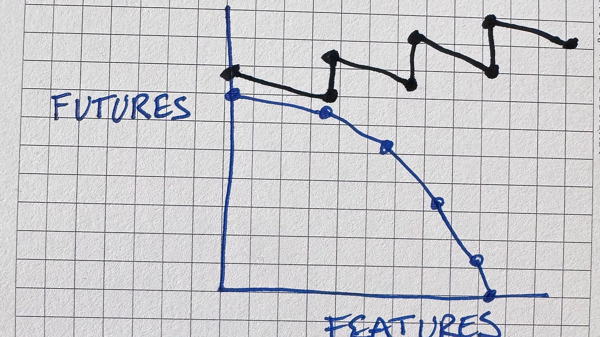

## Working with the Genie

- makes wishes come true, or does it?
- llms can be addictive → take breaks!
- code faster, reach unmaintainable spagetthi faster

---

## Dealing with uncertainty

- llms are inherently non-deterministic → control the bounds
- this is not a new problem → it just shifted to us

## Dealing with llm code volume

- what is programming?
  - understanding the problem → llm can assist
  - solving the problem → llm can assist, sometimes
  - writing code → llm can write most of it
  - understanding other peoples code → llm can assist

---

when llms write code, good old software practices become even more important

---

- good comments
- good documentation
- good debuggers!
- fast build system and dev tooling
- good test suite
- composable software architecture
- good abstractions → at the right places!
- fast ci/cd pipelines
- automation

---

invest energy in those!

---

llm code passes pipeline → more confidence → less review
